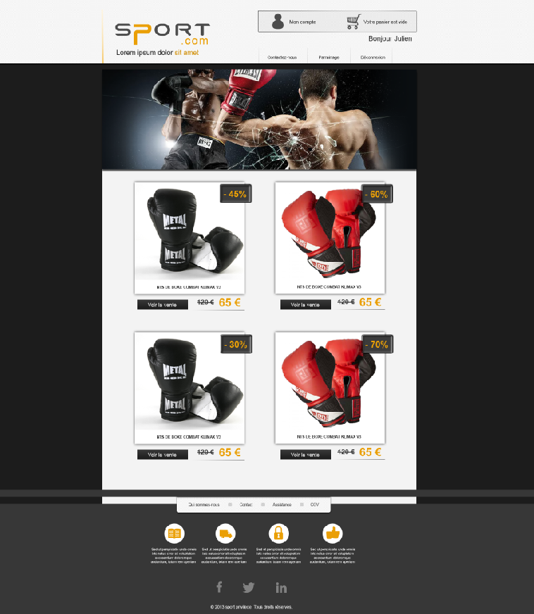

# premiere-evaluation

Exercice effectué lors de la première évaluation HTML/CSS chez WebForce3 avec mon formateur [Guillaume Bouyer](https://www.linkedin.com/in/guillaume-bouyer-872034175/). 
Le but étant de reproduire une maquette donnée sans le côté responsive avec les images fournis. :computer: 

## Maquette demandée

